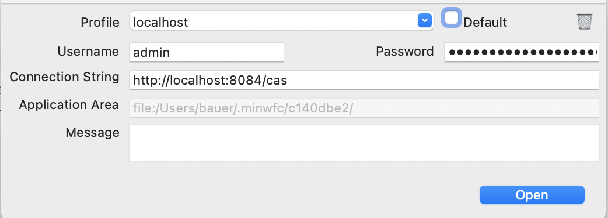

# Authorisierung

Um eine FreeTables Anwendung verwenden zu können, wird der WFC Client benötigt. Das WFC ist eine universale Software, die für mehrere Minova Produkte verwendet werden kann. So hat man auf alle seine Produkte Zugriff, von einer Anwendung aus. 

Um zwischen den Produkten zu unterscheiden, werden Workspaces verwendet. Die Kofiguration eines Produktes liegt nämlich auf einem Server. Mit welchem Server die Verbindung hergestellt werden soll wird beim Login im Feld "Connection String" festgelegt. Die Felder Username und Password müssen dann entsprechend die Benutzer-Login-Daten für den eingetragenen Server enthalten.

Hinweis: Die Anzahl an Punkten im Feld Password gleicht nicht der Länge des Passwortes. Dies dient der höheren Sicherheit, da es nicht möglich ist zu erraten, wie lang das Passwort ist.

Um die Eingabe der Zugangsdaten nicht bei jedem Start zu wiederholen, können diese in einem Profil gespeichert werden. Hierzu wird im Feld Profile ein beliebiger Name eingegeben, der noch nicht als Profil existiert. Mit dem Betätigen von der Schaltfläche "Open", wird nun das Profil gespeichert.

Soll nun nur ein bestimmtes Profile beim Start direkt verwendet werden, kann der Haken bei "Default" gesetzt werden, wenn das entsprechende Profil selektiert ist. Dies sorgt nun dafür, dass beim Start der Anwendung die Anmeldung auf das "Default" Profil ausgeführt wird und statt dem Login Fenster, sich die Anwendung öffnet.

Das "Default" Profil kann in den Einstellungen unter [Standard Workspace](../preferences/overview.md#standard-workspace) zurückgesetzt werden. 

Ein Profil enthält immer einen Workspace. Dieser ist im Benutzerverzeichnis zu finden oder über die Einstellung [Aktueller Workspace Ordner](../preferences/overview.md#aktueller-workspace-ordner). An dieser Stelle kann auch der Workspace gelöscht werden.
Wird der Workspace gelöscht, bleibt das Profile trotzdem bestehen.
