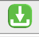
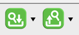
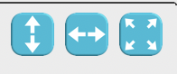
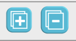

# Farbcode

Die Farbe einer Schaltfläche soll grob die Funktionalität dieser verraten. So symbolisiert jede Farbe einen eigenen Funktionsbereich. Dadurch ergeben sich folgende Farben:

#### Grün

Grün steht für Sichern oder Laden. So wird im Detailbereich mit der grünen Schaltfläche der aktuelle Datensatz gespeichert und im Indexbereich können mit dem Betätigen der linken grünen Schaltfläche Daten geladen werden.

\
Datensatz speichern im Detailbereich

\
Datensätze laden im Index

\
Suchkriterien speichern im Suchbereich

#### Gelb

Die Farbe Gelb symbolisiert die Neutralität. Die Funktionen von gelben Schaltflächen wirken sich nicht auf Datensätze aus. Sie leeren zum Beispiel den Such- und Detailbereich, damit ein neues Suchkriterium oder ein neuer Datensatz angelegt werden können.

\
Nicht gespeicherte Änderungen rückgängig machen im Detailbereich

\
Neuer Datensatz, neue Zeile oder neue Suche

#### Rot

Rot steht für das Entfernen oder Löschen von etwas. Im Detaibereich wird mit der roten Schaltfläche der ausgewählte Datensatz gelöscht. In Tabellen wird damit die seletierte Zeile entfernt.

\
Löschen eines Datensatzes oder einer Zeile

#### Blau

Blau steht immer für eine visuelle Veränderung. Dies kann heißen, dass die Breite des Detailbereichs sich ändert, die Spalten in Tabellen angepasst werden oder Tabellengruppen geöffnet oder geschlossen werden. 

\
Schaltflächenleiste Tabellen Sektion

\
Gruppen zu- und ausklappen im Index
