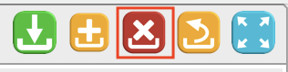

# Detailbereich Schaltflächenleiste

Der [Detailbereich](/masks/overview.md#3-detailbereich) hat eine Schaltflächenleiste. Diese enthält detailspezifische Schaltflächen. Sie wirken sich nur auf den Detailbereich aus, in dem sie sich befinden. Dabei wird zwischen standard und eigenen Schaltflächen unterschieden.

## Standard Schaltflächen

#### Datensatz Speichern

Mit dieser Schaltfläche wird der aktuelle Datensatz gespeichert. Sie ist deaktiviert, bis alle Pflichtfelder im Detailbereich ausgefüllt wurden.

#### Neuer Datensatz

Mit dieser Schaltfläche wird der Detailbereich geleert und ein neuer Datensatz angelegt werden. Sind nicht gespeicherte Änderung im Detailbereich, wird nachgefragt, falls nicht deaktiviert, ob diese verworfen werden sollen.

#### Datensatz löschen

Mit dieser Schaltfläche wird der aktuelle Datensatz gelöscht.

#### Nicht gespeicherte Änderungen verwerfen

Wurde ein Datensatz im Index selektiert und im Detailbereich geändert, so können die nicht gespeicherten Änderung mit dieser Schaltfläche verworfen werden. Solange nicht deaktiviert, wird vor dem Verwerfen noch einmal nachgefragt, ob diese tatsächlich verworfen werden sollen.

#### Detailbereich optimieren

Mit dieser Schaltfläche wird die Breite und Position des Detailbereichs an die Größe der Anwendung angepasst.

## Eigene Schaltflächen

Für weitere Funktionalitäten können zusätzliche Schaltflächen definiert werden. Diese positionieren sich ganz links in der Schaltflächen Leiste.

Im unteren Beispiel ist eine zusätzliche Schaltfläche für das Erstellen von Formularen definiert worden.

