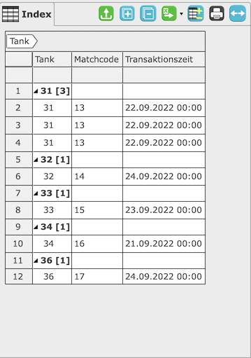
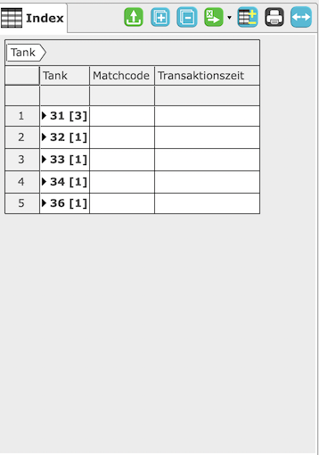

# Indexbereich Schaltflächenleiste

Der [Indexbereich](/masks/overview.md#2-indexbereich) hat eine Schaltflächenleiste. Diese enthält indexspezifische Schaltflächen. Sie wirken sich nur auf den Indexbereich aus, in dem sie sich befinden.

#### Datensätze laden

Mit dieser Schaltfläche werden die Datensätze in der Tabelle neu geladen. Dabei sind die im [Suchbereich](/masks/overview.md#1-suchbereich) eingetragenen Suchkriterien berücksichtigt. 

#### Grupierung zu- und ausklappen

Mit diesen Schatflächen können alle Gruppen im Index aus- oder zugeklappt werden.

Nach Tank gruppierte Ausgabe\
Gruppen offen &emsp;&emsp;&emsp;&emsp;&emsp;&emsp;&emsp;&emsp;&emsp;&emsp;&emsp;&emsp;&emsp;&emsp;&emsp;&emsp;Gruppen geschlossen

 

#### Alle exportieren

Mit dieser Schaltfläche können die Daten im Index in eine Exceldatei exportiert werden.

#### Spalten verwalten

Mit dieser Schaltfläche ist es möglich zu bestimmen, welche Spalten angezeigt werden.

#### Index drucken

Mit dieser Schaltfläche kann die aktuelle Index Ausgabe gedruckt werden.

#### Spalten Breite optimieren

Dieser Schaltfläche passt die Breite von Spalten an, so dass kein Inahlt abgeschnitten wird.

