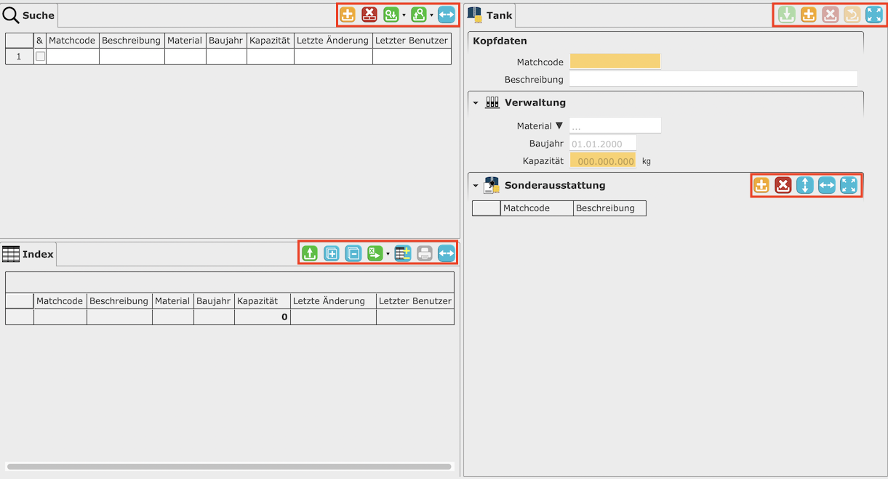

# Schaltflächen

Eine Free Tables Anwendung besitzt viele unterschiedliche Schaltflächen. Diese verteilen sich auf die verschiedenen Bereiche einer [Maske](/masks/overview.md) und auf manche [Sektionen](/masks/sections.md) im [Detailbereich](/masks/overview.md#3-detailbereich).

Die ...

... [Schaltflächen](search_toolbar_bootons.md) im Suchbereich.

... [Schaltflächen](index_toolbar_buttons.md) im Indexbereich.

... [Schaltflächen](detail_toolbar_buttons.md) im Detailbereich.

... [Schaltflächen](grid_toolbar_buttons.md) in einer Tabellensektion.

Alle Schaltflächen folgen einem [Farbcode](colorcode.md). Dies trägt zur höheren Intuitivität und Leichtigkeit der Anwendung bei. Benutzer sind so in der Lage, sich schnell und einfach die verschiedenen Funktionalitäten der Schaltflächen zu merken.
