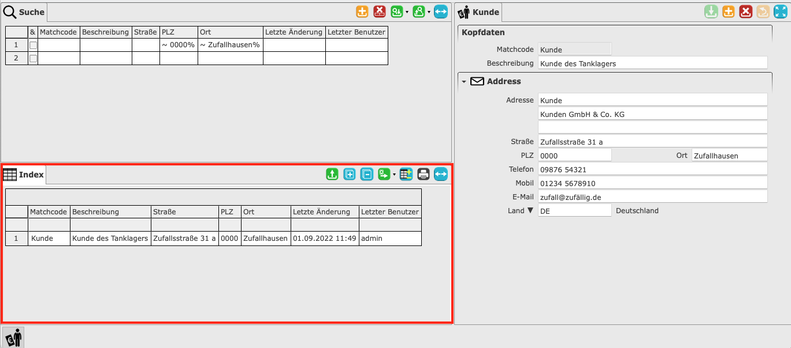

# Masken

Als Maske wird die Oberfläche bezeichnet, mit der der Benutzer interagiert. Sie dient vor allem der Erfassung von Daten. Dabei können eine vielzahl von Daten dargestellt werden. Zum Beispiel Stammdaten, Bewegungsdaten oder Abrechnungsdaten. Eine Maske ist aber auch für die Auswertung nutzbar. So können Statistiken oder Berichte erstellt werden. 

Aufgeteilt ist eine Maske in drei Bereiche. 

#### 1. Detailbereich

Das Detail ist der Fomularbereich. In diesem werden die konkreten Werte in entsprechende Felder eingetragen. Die Felder befinden sich in mehreren [Sektionen](), die immer einen bestimmten Thematischen Abschnitt behandeln. 

Im unteren Beispiel lässt sich ein Kunde erfassen. Der Detailbereich teilt sich hierbei in die Sektionen [Kopfdaten]() und Addresse auf.

#### 2. Indexbereich

Der Index besteht aus einer Tabelle. Diese wird mit den Datensätzen der Maske gefüllt. Es können bis zu 1000 Datensätze ausgegeben werden. Die Ausgabe kann durch die [Suche](#3-suche) gefiltert und damit eingegrenzt werden. Die Spalten der Tabelle entsprechen den wichtigen Feldern des Detailbereiches. 

Die letzten beiden Spalten sind immer "Letzte Änderung" und "Letzter Benutzer". Die Spalte "Letzte Änderung" enthält das Datum, an dem die letzte Änderung durchgeführt wurde. In der Spalte "Letzter Benutzer" wird der username, des Benutzers angezeigt, der die letzte Änderung durchgeführt hat. Dies dient zur besseren Nachverfolgung von Änderungen an Datensätzen.

#### 3. Suchebereich

Um die Ausgabe im Index einzugränzen oder zu filtern, wird der Suchbereich genutzt. Dieser enthält eine identische Tabelle zum Index. Für die Filterung können nun Werte in die Spalten eingegeben werden. Bei der nächsten Aktualisierung des Index, sind nun nur noch Datensätze sichtbar, die die passenden Werte aus der Suche in den entsprechenden Spalten enthalten. Die Eingabe der Werte lässt sich durch spezielle [Platzhalter und Kürzel]() unterstützen.

