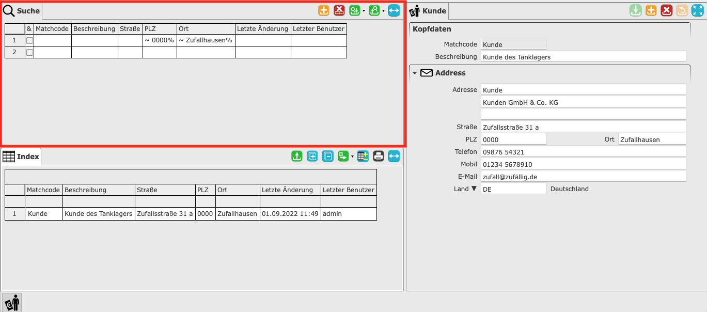
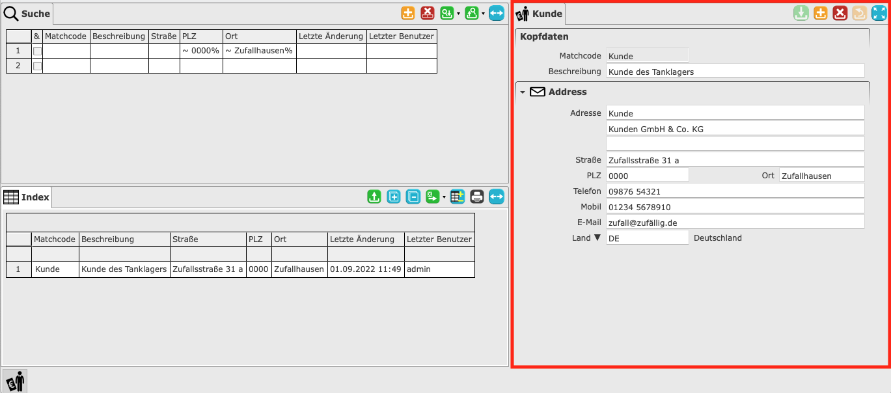

# Masken

Als Maske wird die Oberfläche bezeichnet, mit der der Benutzer interagiert. Sie dient vor allem dem Erfassen und Anzeigen von Daten. Zum Beispiel Stammdaten, Bewegungsdaten oder Abrechnungsdaten. Eine Maske ist aber auch für die Auswertung nutzbar. So können Statistiken oder Berichte erstellt werden. 

Aufgeteilt ist eine Maske in drei Bereiche. Im folgenden Beispiel handelt es sich um Kundenstammdaten.

#### 1. Suchbereich

Um die Ausgabe im Index einzugrenzen oder zu filtern, wird der Suchbereich genutzt. Dieser enthält eine identische Tabelle zum jeweiligen Index. Für die Filterung können nun Werte in die Spalten eingegeben werden. Bei der nächsten Aktualisierung des Index, sind nur noch Datensätze sichtbar, die die passenden Werte aus der Suche in den entsprechenden Spalten enthalten. Die Eingabe der Werte lässt sich durch spezielle [Platzhalter und Kürzel](wildcards.md) unterstützen. Die direkte Anzeige der Daten ohne die Eingabe eines oder mehrerer Suchkriterien hat zur Folge, dass der komplette Datenbestand geladen wird.

#### 2. Indexbereich

Der Index besteht aus einer Tabelle, die mit den Datensätzen der Maske gefüllt wird. Es können bis zu 1000 Datensätze ausgegeben werden. Die Ausgabe kann durch die [Suche](#1-suchbereich) gefiltert und damit eingegrenzt werden. Die Spalten der Tabelle entsprechen den wichtigsten Feldern des Detailbereiches. 

Die letzten beiden Spalten jeder Maske entsprechen "Letzte Änderung" und "Letzter Benutzer". Die Spalte "Letzte Änderung" enthält das Datum, an dem die letzte Änderung durchgeführt wurde. In der Spalte "Letzter Benutzer" wird der Name, des Benutzers angezeigt, der die letzte Änderung durchgeführt hat. Dies dient zur besseren Nachverfolgung von Änderungen an Datensätzen.

#### 3. Detailbereich

Der Detailbereich entspricht einem Fomular. In diesem werden Werte in entsprechende Felder eingetragen. Die Felder befinden sich in mehreren [Sektionen](sections.md), die immer einen bestimmten thematischen Abschnitt behandeln. 

Im unteren Beispiel lässt sich ein Kunde erfassen. Der Detailbereich teilt sich hierbei in die Sektionen [Kopfdaten](sections.md#kopfdaten) und Addresse auf.
Zur Erfassung eines Datensatzes müssen alle Pflichtfelder gefüllt werden. Obligatorische Felder sind orange, optionale Felder sind weiß hinterlegt.

