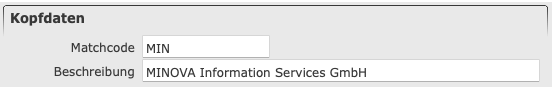

# Sektionen

Als Sektion wird ein Abschnitt im [Detailbereich](overview.md#3-detailbereich) bezeichnet. Diese enthalten Felder und Tabellen. Im folgenden werden standard Sektionen und Felder beschrieben.

#### Kopfdaten

Jede Maske beginnt mit den Kopfdaten. Diese besitzen das Feld [MatchCode](matchcode.md), in dem ein eindeutiges Kürzel für den anzulegenden Datensatz vergeben werden muss. 
Wurde der Datensatz einmal gespeichert, kann der MatchCode nicht mehr verändert werden. 
Er dient als Identifikation des Datensatzes z. B. bei der Eingabe von Adressen oder bei der Auswahl aus einer Liste. 
In diesem Feld sollten Leerzeichen möglichst vermieden werden.

**Beispiel** 
Kopfdaten für den Kunden MINOVA

Auf die Kopfdaten können nun entweder eine weitere normale [Sektion](#sektion), eine [Tabelle](#tabelle) oder eine [Vorschau](#vorschau) folgen.

#### Sektion

Die normale Sektion ist so aufgebaut wie die Kopfdaten und enthält verschiedene Felder, Auswahlboxen und Tabellen. Der einzige Unterschied liegt darin, dass die normale Sektion auf- und zuklappbar ist.

**Beispiel** 
Adresse für den Kunden MINOVA

**Beispiel** 
Zugeklappte Sektion Adresse

#### Tabelle

Die Tabelle kann sowohl als Element in einer Sektion oder eigenständig genutzt werden. Die Funktionsweise unterscheidet sich bei beiden Arten nicht. Die Tabelle hat eine eigene Schaltflächenleiste. Diese enthält Funktionen exklusive für die Tabelle. Die Schaltflächen sind unter [Tabellen Schaltflächen](/doc/buttons/grid_toolbar_buttons.md) genauer beschrieben.

**1. Beispiel** 
Leere Tabelle Sonderausstattung in Stammdaten

**Beispiel** 
Ausgefüllte Tabelle mit Beispieldaten

#### Vorschau

Eine Vorschau Sektion wird immer in Verbindung mit einer Tabelle genutzt. Sie wird nur für die Darstellung des ausgewählten Elements in der Tabelle verwendet. Innerhalb der Sektion können keine anderen Felder angezeigt werden.

