# Einstellungen der Anwendung (Preferences)

Dokumentation der Standard-Einstellungen für die Anwendung, die nicht spezifisch zu einer der Anwendungen (SIS, DISPO, TTA, AFIS) gehören. 

## Anwendungs Tab

### Allgemeines

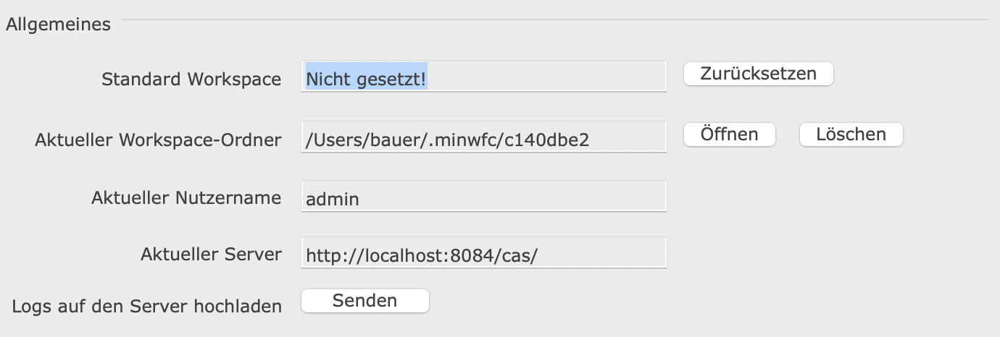

#### Standard Workspace

Zeigt das eingestellte Standard Workspace an und ermöglicht dieses zurückzusetzen. Das Standard-Workspace ist das Profil das automatisch beim Start der Anwendung geladen werden soll.

#### Aktueller Workspace-Ordner

Zeigt den Pfad zum aktuellen Workspace-Ordner an, in dem alle vom CAS geladenen Dateien (unter anderem Masken, Bilder, Übersetzungen, ...) liegen.
Außerdem werden in diesem Ordner die Einstellungen und Logs gespeichert.

Über den Knopf "Öffnen" wird dieser Ordner im Finder/Dateibrowser direkt geöffnet.

Mit dem Knopf "Löschen" wird der Ordner gelöscht, die Anwendung wird automatisch neu gestartet. 

#### Aktueller Nutzername

Zeigt den Namen des aktuell angemeldeten Nutzers an.

#### Aktueller Server

Zeigt die URL des aktuell verbundenen Servers an.

#### Logs auf Server hochladen

Mit diesem Knopf werden die Logs, die im Workspace-Ordner liegen, auf das CAS hochgeladen.
Das ist für Supportfälle hilfreich, um Fehlermeldungen zu überprüfen.

### Tastaturbedienung

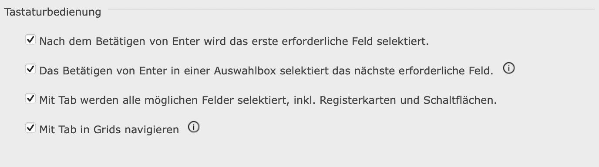

#### Nach dem Betätigen von ENTER wird das erste erforderliche Feld selektiert

Ist dieser Wert gesetzt, wird mit Enter das von oben erste leere Pflichtfeld selektiert.

Position vor dem Betätigen von ENTER:

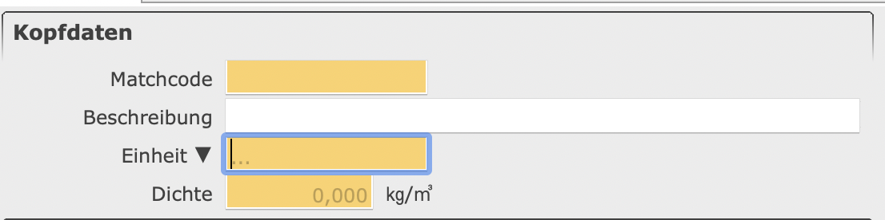

Position nach dem Betätigen von ENTER mit Einstellung ist gesetzt:

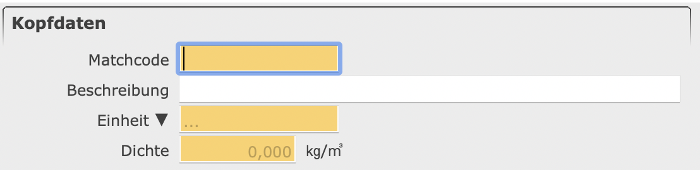

Position nach dem Betätigen von ENTER mit Einstellung ist nicht gesetzt:

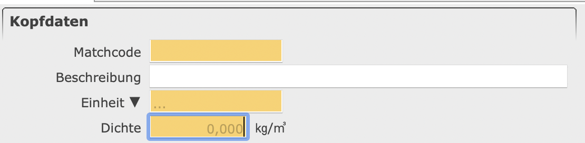

#### Das Betätigen von Enter in einer Auswahlbox selektiert das nächste erforderliche Feld

Für Auswahlboxen (Feld mit kleinem Pfeil und einer Auswahl) kann ein gesondertes Verhalten eingestellt werden. So wird nach einer Auswahl mit Enter entweder das nächste Pflichtfeld selektiert oder der Benutzer bleibt im Feld stehen.

Position vor dem Betätigen von ENTER in der Auswahlbox:

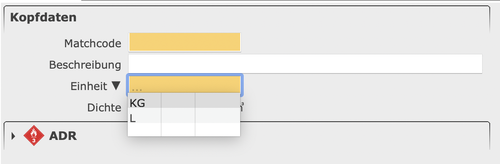

Position nach dem Betätigen von ENTER in der Auswahlbox mit gesetzer Einstellung:

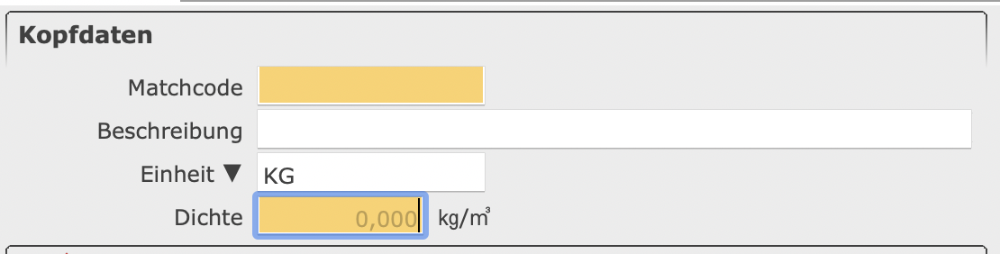

Position nach dem Betätigen von ENTER in der Auswahlbox mit nicht gesetzer Einstellung:

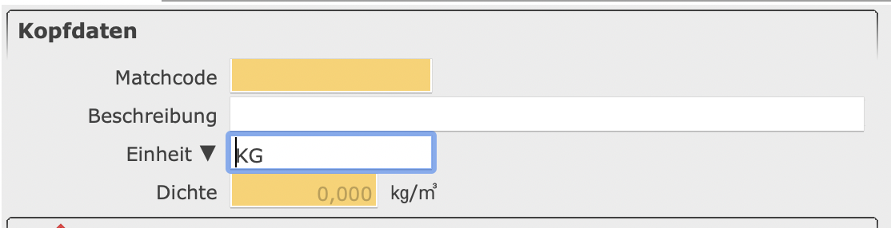

Die Einstellung ["Nach dem Betätigen von ENTER wird das erste erforderliche Feld selektiert"](#nach-dem-betätigen-von-enter-wird-das-erste-erforderliche-feld-selektiert) darf nicht gesetzt sein, damit diese Einstellung greift.

#### Mit Tab werden alle möglichen Felder selektiert, inkl. Registerkarte und Schaltflächen

Ist diese Einstellung gesetzt, sind mit Tab alle Bereiche im Detailbereich erreichbar. Hierzu zählen zum Beispiel Schaltfläche und Registerkarten von Sektionen. 

Position vor dem Betätigen von TAB:

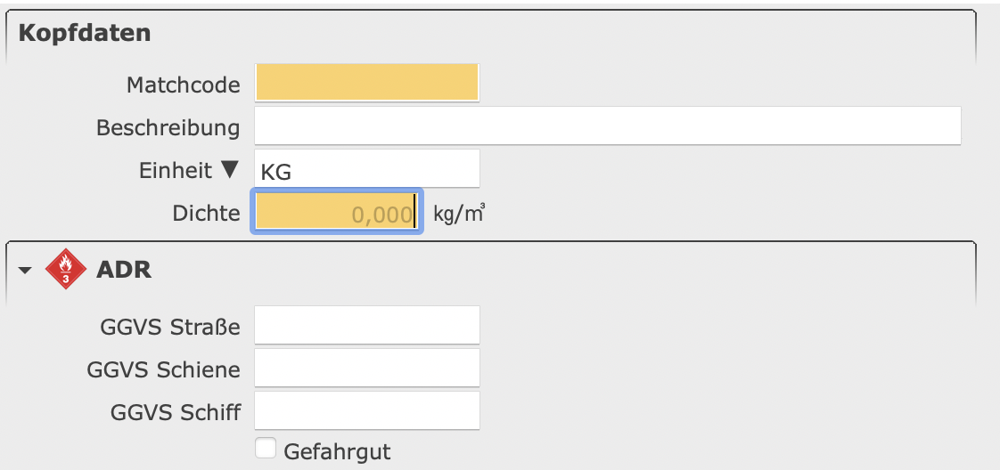

Position nach dem Betätigen von TAB mit gesetzer Einstellung:

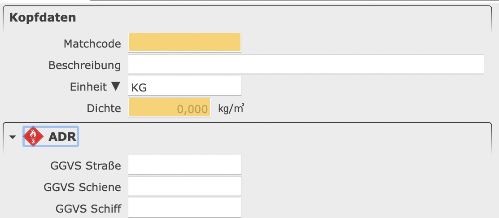

Position nach dem Betätigen von TAB  mit nicht gesetzer Einstellung:

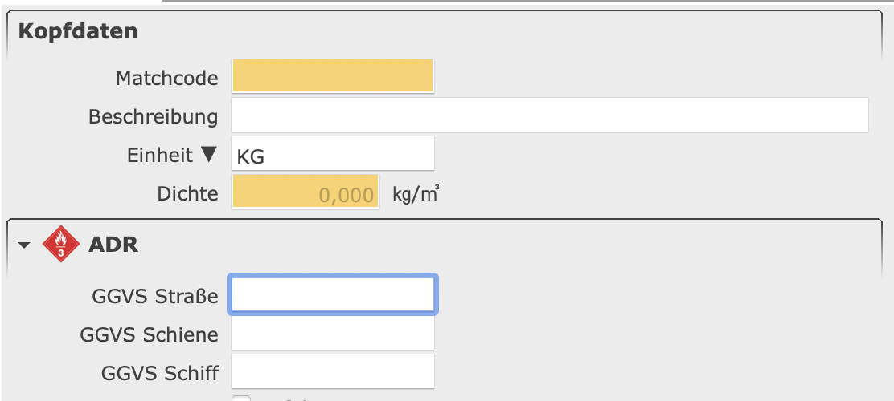

#### Mit Tab in Grids navigieren

Ausgewählt wird die Navigation mit Tab zwischen den einzelnen Zellen im Grid erlaubt. Nicht ausgewählt wird mit Tab das Grid verlassen und das nächste Element selektiert.

## Darstellungs Tab

### Allgemeines

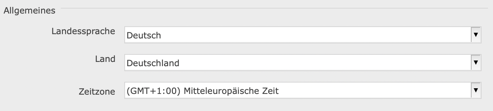

#### Landessprache

Bestimmt die Sprache der Anwendung.

#### Land

Bestimmt das Land, das für das Locale genutzt wird.

#### Zeitzone

Bestimmt die Zeitzone des Anwenders. Der Server arbeitet immer in der Zeitzone UTC.

### Design-Einstellungen

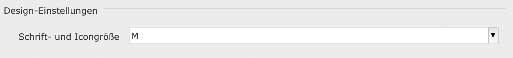

#### Schrift- und Icongröße

Bestimmt die Schrift- und Icongröße der Anwendung.

### Formatierung

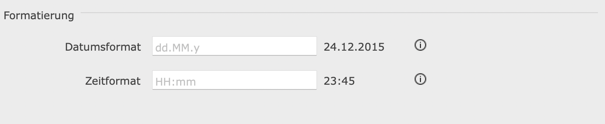

#### Datumsformat

Das Pattern bestimmt die Formatierung des Datums. Dabei bestimmt dieses nur die Darstellung des Datums, aber nicht die Reihenfolge von Tag, Monat und Jahr.

**Beispiel:**
| **Pattern** | **Eingabe** | **Ausgabe**
|---|---|---|
| dd.MM.y | 120220 | 12.02.2020
| dd/MMM/yy | 120220 | 12/Feb./20
| MM.dd.yyyy | 120220 | 12.02.2020

Die Message im Textfeld, stellt das Standard Pattern für das ausgewählte Locale da.

#### Zeitformat

Das Pattern bestimmt die Formatierung der Zeit. Dabei bestimmt die Eingabe nicht nur die Darstellung, sondern auch, ob das 12-Stunden oder das 24-Stunden Format verwendet wird.
Bei dem Pattern mit kleinem **h** wird das 12-Stunden Format verwendet und bei großen **H** wird das 24-Stunden Format verwendet.

**Beachten: Wenn im Pattern kein a hinzugefügt wird, wird AM/PM nicht mit dargestellt!!**
Das AM/PM wird in die entsprechende Sprache übersetzt.

**Beachten: nicht M und m verwechseln!**

**Beispiel:**

| **Pattern** | **Eingabe** | **Ausgabe**
|---|---|---|
| hh:mm | 2345 | 11:45
| hh:mm a | 2345 | 11:45 PM
| HH:mm | 2345 | 23:45
| H:mm | 726 | 7:26
| HH:mm | 726 | 07:26

Die Message im Text Feld, stellt das Standard Pattern für das ausgewählte Locale da.

## Erweitert Tab

### Allgemeines

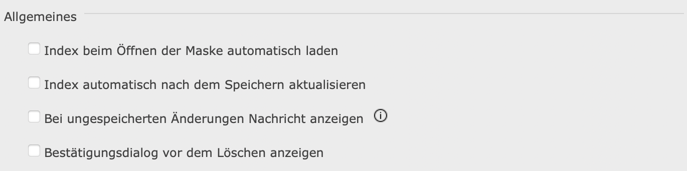

#### Index beim Öffnen der Maske automatisch laden

Die Daten im Index werden beim Öffnen der Maske automatisch geladen.

#### Index automatisch nach dem Speichern aktualisieren

Der Index wird nach dem Speichern automatisch aktualisiert.

#### Nachricht bei ungespeicherten Änderungen anzeigen

Zeigt eine Nachricht an, wenn ungespeicherte Änderungen durch das Laden eines Datensatzes im Index verworfen werden.

#### Bestätigungsdialog vor Löschen

Zeigt einen Bestätigungsdialog an, bevor ein Datensatz gelöscht wird. Der Default-Wert für diese Einstellung wird aus der XBS ausgelesen (ShowDeleteDialog).
Die Entscheidung der Nutzer übertrifft aber die XBS-Einstellung.

### Index

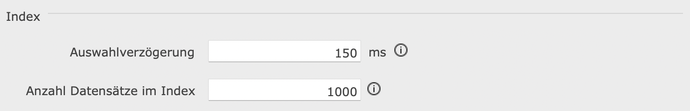

#### Auswahlverzögerung [ms]

Bestimmt die Dauer, die bei einer Auswahl gewartet wird, bevor das Event gesendet wird. Zum Beispiel, wenn man mit den Pfeiltasten
durch die Tabelle geht, wird nicht bei jeder Auswahl das Event gesendet, sondern nur, wenn in dem angegebenen Zeitraum die Auswahl
nicht geändert wurde.

#### Anzahl Datensätze im Index

Wenn mehr als diese Anzahl Datensätze angefragt wird erscheint ein Dialog, um die Anzahl zu begrenzen.

### Timeout

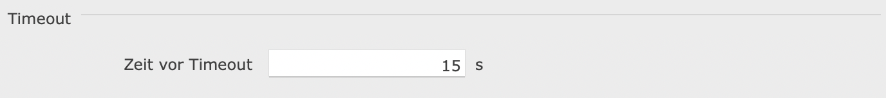

#### Zeit vor Timeout [s]

Bestimmt die Dauer, bevor eine Anfrage an den Server als nicht erfolgreich angesehen wird.

### Experten Modus

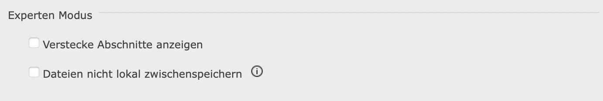

#### Versteckte Abschnitte anzeigen

Manche Abschnitte sind nur sichtbar, wenn diese Option gewählt ist.
Das Ein-/Eusblenden wird über die Helper der einzelnen Masken geregelt.
Ersatz für Teil des SuperUser Modus von Version 11.

#### Dateien nicht lokal zwischenspeichern

Wenn diese Einstellung gesetzt ist reicht es, eine Maske zu schließen und wieder zu öffnen um die entsprechende .xml Datei erneut vom CAS zu laden. Der Hash wird komplett ignoriert.

Für Änderungen an .mdi, .xbs, Übersetzungen und Bildern muss die Anwendung allerdings dennoch neu gestartet werden, da diese Dateien nur beim Start heruntergeladen werden.

Die Einstellung verlangsamt die Anwendung, da öfter Dateien heruntergeladen werden.

## Drucken Tab

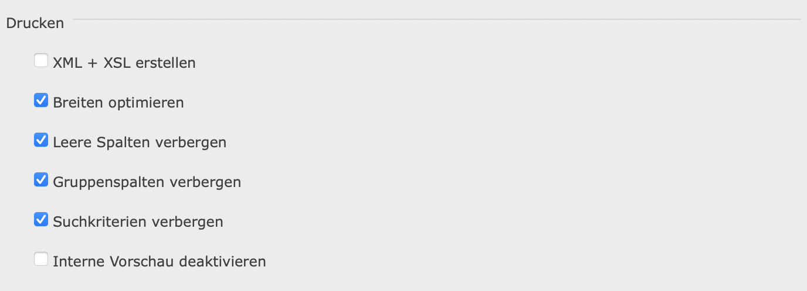

### Drucken

#### XML + XSL erstellen

Erstellt beim Drucken neben einem PDF auch eine XML und XSL Datei im gleichen Ordner.

#### Breiten optimieren

Optimiert die Breiten der Spalten beim Drucken.

#### Leere Spalten verbergen

Verbirgt beim Drucken die leeren Spalten.

#### Gruppenspalten verbergen

Verbirgt beim Drucken die Spalten, die die Gruppen bilden.

#### Suchkriterien verbergen

Verbirgt beim Drucken die Suchkriterien.

#### Interne Vorschau verbergen

Deaktiviert die interne Druckvorschau. Das PDF wird direkt im Standard-PDF Reader geöffnet.
